# CNVpytor - a python extension of CNVnator

CNVpytor is a Python package and command line tool for CNV analysis from depth-of-coverage by mapped reads developed in Abyzov Lab, Mayo Clinic.

**CNVpytor project is in early development stage.**


## Gallery

| | |
|---|---|
| Manhattan plot ([see example](examples/manhattan.md))| Circular plot ([see example](examples/circular.md))|
|||
| Region plot ([see example](examples/region.md))| Compare regions ([see example](examples/compare.md))|
|||

## Dependencies

* gnureadline
* requests
* pysam
* numpy
* scipy
* matplotlib
* h5py >= 2.9

Optional:

* ROOT - for CNVnator root import/export functionality
* seaborn - for additional plotting styles 

## Install

### Install by cloning from GitHub

```
> git clone https://github.com/abyzovlab/CNVpytor.git
> cd CNVpytor
> pip install .
```
For single user (without admin privileges) use:
```
> pip install --user .
```

### Install using pip

```
> pip install cnvpytor
> cnvpytor -download
```

## Simple example

Call CNV using read depth:
```
> cnvpytor -root file.pytor -rd file.bam
> cnvpytor -root file.pytor -his 1000 10000 100000
> cnvpytor -root file.pytor -partition 1000 10000 100000
> cnvpytor -root file.pytor -call 1000 10000 100000
```

Call CNV using single nucleotide polymorphism::
```
> cnvpytor -root file.pytor -snp file.vcf
> cnvpytor -root file.pytor -pileup file.bam
> cnvpytor -root file.pytor -baf 10000 100000
> cnvpytor -root file.pytor -call baf 10000 100000
```

Plot
```
> cnvpytor -root file.pytor -plot stat
> cnvpytor -root file.pytor -plot 10000 100000
> cnvpytor -root file.pytor -plot stat manhattan 100000 -o prefix.pdf
> cnvpytor -root file.pytor -plot baf -chrom 1 2 3 4
> cnvpytor -root file.pytor -plot regions 1:10M-20M,2:20M-43M 3:10M-20M 10000
> cnvpytor -root file.pytor -plot circular 100000 -use_mask_rd -o prefix.png
```

Plot - interactive mode
```
> cnvpytor -root file.pytor -view 10000
cnvpytor> chr1:1M-50M
cnvpytor> rd
cnvpytor> set panels rd likelihood
cnvpytor> show
    Parameters
        * bin_size: 100000
        * panels: ['rd','likelihood']
        * use_mask_rd: False
        * use_mask: True
        * use_id: False
        * plot_files:
             0 file1.pytor True
             1 file2.pytor True
             2 file3.pytor True
        * plot_file: 0
        * grid: auto

cnvpytor> set bin_size 100000
cnvpytor> chr1:1M-50M chr2:60M-65M > filename.png
```
## Pipeline scheme



Diagram made using [Draw.io](https://github.com/jgraph/drawio).


## Use as Python package

CNVpytor is not just command line tool but also Python package. 

For more details check [API Documentation](https://abyzovlab.github.io/CNVpytor/)
## Export
### 1. CNVpytor data visualization using jbrowse
#### Usage
To generate cnvpytor file for jbrowse visualization:
```
cnvpytor -root [pytor files] -export jbrowse [optional argument: output path]
 ```
The above command creates all the necessary files that are required to visualize the cnvpytor data. Default export directory name, for multiple pytor file is `cnvpytor_jbrowse_expor` and for single pytor files is `jbrwose_[pytor file name]`.

The user needs to copy the directory to the jbrowse directory If the output path is not set to jbrowse localhost path.

To view cnvpytor file using jbrowse, users need to install jbrowse and required plugins (See Jbrowse version and plugins section).
```
http://localhost/jbrowse/?data=[export directory] 
```
Example
```
cnvpytor -root test.pytor -export jbrowse
http://localhost/jbrowse/?data=jbrowse_test
```
#### Jbrowse version and plugins
Jbrowse version: https://github.com/GMOD/jbrowse/archive/1.16.6-release.tar.gz
plugins:
 - multibigwig (https://github.com/elsiklab/multibigwig )
 - multiscalebigwig (https://github.com/cmdcolin/multiscalebigwig)
 
**Note:** The jbrowse development version is required as integration of different jbrowse plugins is required.

#### Data Description
There are mainly two types of data cnvpytor processes. i.e.; Read depth data from alignment file and SNP data from variant file. Depending on the availability of these two input data, the export function works.

For Read depth data, it exports ‘Raw segmented RD’, ‘GC corrected Raw Segmented RD’, ‘GC corrected RD partition’, ‘CNV calling using RD’ . All of these Read depth signals are plotted on top of each other on a single horizontal level using color gray, black, green and red respectively.
For SNP data, it exports ‘Binned BAF‘, ‘Likelihood of the binned BAF’’ signals. These two signals are plotted on top of each other with gray and Red color.

|Data           |Signal name with color on Jbrowse |
|---------------|----------------------------------|
|Read Depth     |Raw Segmented RD (Gray) <br>GC Corrected Raw Segmented RD (Black) <br> GC corrected RD partition (Green) <br> CNV call using RD signals (Red) |
|SNP            |Binned BAF (Gray) <br> Likelihood of the Binned BAF(Red)|

cnvpytor does the segmentation for all of the above data based on the user provided bin size. The multiscalebigwig provides the option to show the data based on the visualized area on the reference genome, which means if a user visualizes a small region of the genome it shows small bin data and vice versa.           
## Bugs

Please report any bugs that you find on GitHub:
https://github.com/abyzovlab/CNVpytor/issues

Or, even better, fork the repository on GitHub and create a pull request.

## License

Released under MIT licence.


